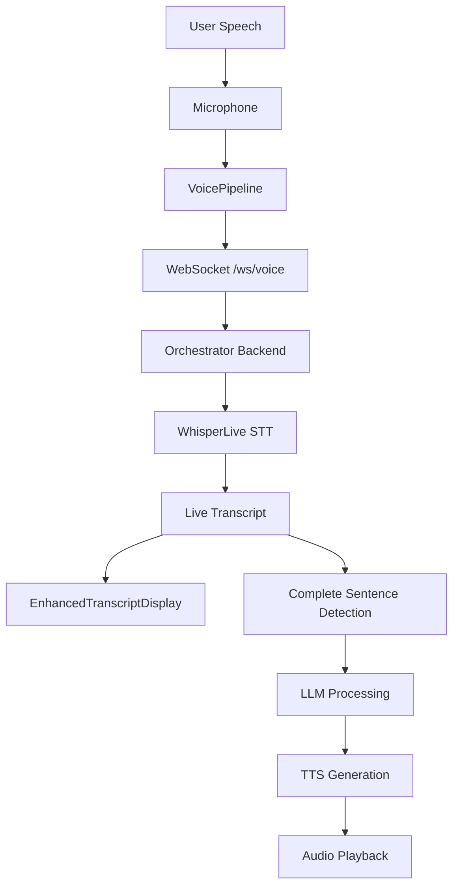

# Transcript Display System Implementation

This guide documents the complete implementation of the transcript display system based on commit `ee6fd0d58c2ac0290b60d233d9997b11b740b7cb`.

## Overview

The transcript display system provides real-time transcription feedback during voice interactions, showing both live incomplete text and processed complete sentences.

## Architecture

### End-to-End Flow



## Components

### 1. EnhancedTranscriptDisplay Component
**File:** `ui/components/EnhancedTranscriptDisplay.tsx`

Features:
- Real-time transcript display
- Recording indicator (red pulse)
- Processing indicator (yellow spin)
- Transcript history tracking
- Responsive design with backdrop blur

### 2. Voice Store (State Management)
**File:** `ui/stores/voice.ts`

State includes:
- `transcript`: Current live text
- `isRecording`: Recording state
- `isProcessing`: Processing state
- `isConnected`: WebSocket connection status
- `sessionId`: Current session identifier

### 3. Voice Pipeline
**File:** `ui/lib/voice-pipeline.ts`

Handles:
- WebSocket connection to orchestrator
- Audio capture and processing
- Float32Array streaming at 16kHz
- Message routing and state synchronization
- Audio playback for TTS responses

### 4. Backend Integration
**File:** `orchestrator/src/main.py`

Provides:
- `/ws/voice` WebSocket endpoint
- Live transcript messages: `{"type": "live_transcript", "text": "..."}`
- Complete sentence detection
- LLM and TTS processing

## Usage

### Basic Setup

1. **Install dependencies:**
```bash
npm install zustand
```

2. **Start the orchestrator:**
```bash
cd orchestrator
python src/main.py
```

3. **Start the frontend:**
```bash
cd ui
npm run dev
```

### Testing the System

#### Manual Testing
Visit `/test-transcript-flow` to access the comprehensive test page with:
- Manual transcript injection
- Live connection testing
- Recording controls
- Real-time state inspection

#### Live Testing
1. Click "Connect Live" to establish WebSocket connection
2. Click "Start Recording" to begin audio capture
3. Speak naturally to see live transcriptions
4. Complete sentences will trigger LLM+TTS processing

### Integration in Your App

#### Basic Usage
```tsx
import EnhancedTranscriptDisplay from '@/components/EnhancedTranscriptDisplay';
import { getVoicePipeline } from '@/lib/voice-pipeline';

function VoiceInterface() {
  const pipeline = getVoicePipeline();
  
  useEffect(() => {
    pipeline.initialize();
    return () => pipeline.cleanup();
  }, []);

  return (
    <div>
      <EnhancedTranscriptDisplay />
      <button onClick={() => pipeline.startRecording()}>Start</button>
      <button onClick={() => pipeline.stopRecording()}>Stop</button>
    </div>
  );
}
```

#### Advanced Usage
```tsx
import { useVoiceStore } from '@/stores/voice';

function VoiceControls() {
  const { isRecording, isProcessing, transcript } = useVoiceStore();
  
  return (
    <div>
      <p>Recording: {isRecording ? 'Yes' : 'No'}</p>
      <p>Processing: {isProcessing ? 'Yes' : 'No'}</p>
      <p>Current: {transcript}</p>
    </div>
  );
}
```

## Configuration

### Environment Variables
```bash
# Frontend
NEXT_PUBLIC_ORCHESTRATOR_WS_URL=ws://localhost:8000

# Backend (orchestrator)
WHISPER_URL=ws://localhost:9090
OLLAMA_URL=http://localhost:11434
TTS_URL=http://localhost:8000
```

### Audio Settings
- Sample rate: 16kHz
- Format: Float32Array
- Channels: Mono
- Buffer size: 4096 samples

## API Messages

### From Backend to Frontend
- `live_transcript`: Real-time incomplete text
- `processing_started`: Sentence processing began
- `sentence_audio`: TTS audio data
- `processing_complete`: Processing finished
- `interrupted`: User interrupted
- `error`: Error messages

### From Frontend to Backend
- `end_audio`: Stop recording
- `interrupt`: Interrupt current processing
- `ultra_fast_text`: Direct text input

## Testing

### Test Page Features
- **Manual Mode**: Add test transcripts via button clicks
- **Live Mode**: Real voice interaction
- **Connection Status**: WebSocket health monitoring
- **Debug Info**: Real-time state inspection
- **History Tracking**: Previous transcripts

### Debug Commands
```javascript
// Check current state
console.log(useVoiceStore.getState());

// Test manual transcript
useVoiceStore.getState().setTranscript("Test transcript");

// Check pipeline status
const pipeline = getVoicePipeline();
console.log(pipeline.isConnected);
```

## Troubleshooting

### Common Issues

1. **No transcript appearing**
   - Check WebSocket connection status
   - Verify microphone permissions
   - Check browser console for errors

2. **Audio not playing**
   - Ensure TTS service is running
   - Check audio format compatibility
   - Verify base64 decoding

3. **Connection failures**
   - Verify orchestrator is running on correct port
   - Check CORS settings
   - Ensure WebSocket URL is correct

### Debug Logging
Enable debug logging by setting:
```javascript
// In browser console
localStorage.setItem('debug', 'voice:*');
```

## Performance Metrics

The system tracks:
- STT latency (speech to text)
- LLM first token latency
- LLM total response time
- TTS generation latency
- Total pipeline latency

These metrics are logged in the orchestrator backend for performance analysis.

## Next Steps

1. **Customization**: Modify EnhancedTranscriptDisplay styling
2. **Extensions**: Add speaker identification
3. **Optimization**: Implement audio compression
4. **Features**: Add transcript persistence
5. **Testing**: Add automated tests for the flow