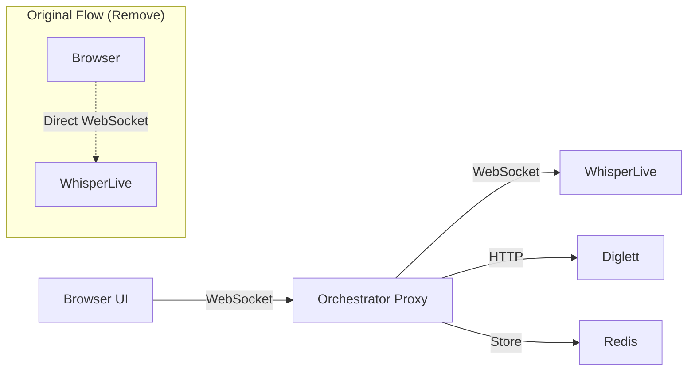

# 🔄 **Foolproof WebSocket Proxy: Browser → Orchestrator → WhisperLive**

You're right to be cautious! The safest approach is to create a **WebSocket proxy** in the orchestrator that maintains the exact same interface the browser expects, while adding speaker recognition in the middle.

## 🎯 **Strategy: Drop-in WebSocket Replacement**



## 🔧 **Step 1: WebSocket Proxy in Orchestrator**

```python
# orchestrator/src/websocket_proxy.py - NEW FILE
import asyncio
import json
import logging
import websockets
from typing import Dict, Optional
from fastapi import WebSocket, WebSocketDisconnect
import httpx

class WhisperLiveProxy:
    """
    Foolproof WebSocket proxy that maintains exact browser compatibility
    while adding speaker recognition in the middle
    """
    
    def __init__(self, whisperlive_url: str, speaker_service, session_manager):
        self.whisperlive_url = whisperlive_url.replace('http://', 'ws://').replace('https://', 'wss://')
        self.speaker_service = speaker_service
        self.session_manager = session_manager
        
        # Track active connections
        self.browser_connections: Dict[str, WebSocket] = {}
        self.whisperlive_connections: Dict[str, websockets.WebSocketServerProtocol] = {}
        
        logging.basicConfig(level=logging.INFO)
        self.logger = logging.getLogger(__name__)
    
    async def handle_browser_connection(self, websocket: WebSocket, session_id: str):
        """
        Handle WebSocket connection from browser - maintains exact compatibility
        """
        await websocket.accept()
        self.browser_connections[session_id] = websocket
        
        try:
            # Establish connection to WhisperLive
            whisperlive_ws = await self._connect_to_whisperlive()
            self.whisperlive_connections[session_id] = whisperlive_ws
            
            self.logger.info(f"WebSocket proxy established for session {session_id}")
            
            # Start bidirectional relay with speaker recognition
            await asyncio.gather(
                self._relay_browser_to_whisperlive(websocket, whisperlive_ws, session_id),
                self._relay_whisperlive_to_browser(whisperlive_ws, websocket, session_id),
                return_exceptions=True
            )
            
        except WebSocketDisconnect:
            self.logger.info(f"Browser disconnected: {session_id}")
        except Exception as e:
            self.logger.error(f"WebSocket error for {session_id}: {e}")
        finally:
            # Cleanup connections
            await self._cleanup_connections(session_id)
    
    async def _connect_to_whisperlive(self) -> websockets.WebSocketServerProtocol:
        """Connect to WhisperLive WebSocket"""
        try:
            # Use same connection parameters as original Maestro
            whisperlive_ws = await websockets.connect(
                self.whisperlive_url,
                timeout=10,
                ping_interval=20,
                ping_timeout=10
            )
            return whisperlive_ws
        except Exception as e:
            self.logger.error(f"Failed to connect to WhisperLive: {e}")
            raise
    
    async def _relay_browser_to_whisperlive(
        self, 
        browser_ws: WebSocket, 
        whisperlive_ws: websockets.WebSocketServerProtocol,
        session_id: str
    ):
        """
        Relay messages from browser to WhisperLive
        EXACTLY as the browser expects - no modifications to the protocol
        """
        try:
            while True:
                # Receive from browser (could be text or bytes)
                try:
                    message = await browser_ws.receive()
                    
                    if "text" in message:
                        # Text message (configuration, etc.)
                        data = message["text"]
                        self.logger.debug(f"Browser->WhisperLive text: {data[:100]}...")
                        await whisperlive_ws.send(data)
                        
                    elif "bytes" in message:
                        # Audio data - this is where we add speaker recognition
                        audio_data = message["bytes"]
                        self.logger.debug(f"Browser->WhisperLive audio: {len(audio_data)} bytes")
                        
                        # SPEAKER RECOGNITION (non-blocking)
                        asyncio.create_task(
                            self._process_speaker_recognition(audio_data, session_id)
                        )
                        
                        # Forward audio to WhisperLive unchanged
                        await whisperlive_ws.send(audio_data)
                        
                except WebSocketDisconnect:
                    break
                except Exception as e:
                    self.logger.error(f"Error relaying browser->WhisperLive: {e}")
                    break
                    
        except Exception as e:
            self.logger.error(f"Browser->WhisperLive relay error: {e}")
    
    async def _relay_whisperlive_to_browser(
        self,
        whisperlive_ws: websockets.WebSocketServerProtocol,
        browser_ws: WebSocket,
        session_id: str
    ):
        """
        Relay messages from WhisperLive to browser
        Can enhance with speaker information here
        """
        try:
            async for message in whisperlive_ws:
                try:
                    # Parse WhisperLive response
                    if isinstance(message, str):
                        data = json.loads(message)
                        
                        # ENHANCEMENT: Add speaker information to transcription
                        enhanced_data = await self._enhance_with_speaker_info(data, session_id)
                        
                        # Send enhanced response to browser
                        await browser_ws.send_text(json.dumps(enhanced_data))
                        
                        self.logger.debug(f"WhisperLive->Browser: {enhanced_data}")
                        
                    else:
                        # Binary data - forward unchanged
                        await browser_ws.send_bytes(message)
                        
                except WebSocketDisconnect:
                    break
                except Exception as e:
                    self.logger.error(f"Error relaying WhisperLive->Browser: {e}")
                    break
                    
        except Exception as e:
            self.logger.error(f"WhisperLive->Browser relay error: {e}")
    
    async def _process_speaker_recognition(self, audio_data: bytes, session_id: str):
        """
        Process speaker recognition in background without blocking audio flow
        """
        try:
            # Extract speaker embedding
            embedding = await self.speaker_service._extract_speaker_embedding(audio_data)
            
            # Get current speaker database
            speaker_db = await self.session_manager._load_speaker_database()
            
            # Find best match
            best_match = self._find_speaker_match(embedding, speaker_db)
            
            # Update session with speaker info
            await self.session_manager.update_session_speaker(session_id, {
                "current_speaker": best_match,
                "confidence": best_match.get("confidence", 0.0) if best_match else 0.0,
                "embedding_preview": embedding[:5].tolist()
            })
            
        except Exception as e:
            self.logger.error(f"Speaker recognition error: {e}")
    
    async def _enhance_with_speaker_info(self, whisperlive_data: dict, session_id: str) -> dict:
        """
        Enhance WhisperLive response with speaker information
        """
        try:
            # Get session data
            session_data = await self.session_manager.get_session(session_id)
            speaker_info = session_data.get("speaker_info", {}) if session_data else {}
            
            # Add speaker information to the response
            enhanced_data = {
                **whisperlive_data,
                "speaker_info": {
                    "current_speaker": speaker_info.get("current_speaker"),
                    "confidence": speaker_info.get("confidence", 0.0),
                    "session_id": session_id
                }
            }
            
            return enhanced_data
            
        except Exception as e:
            self.logger.error(f"Error enhancing with speaker info: {e}")
            return whisperlive_data  # Return original data on error
    
    def _find_speaker_match(self, embedding, speaker_db) -> Optional[dict]:
        """Simple speaker matching logic"""
        # Implement your speaker matching logic here
        # This is a placeholder - you can make it as sophisticated as needed
        return None
    
    async def _cleanup_connections(self, session_id: str):
        """Clean up connections when session ends"""
        if session_id in self.browser_connections:
            del self.browser_connections[session_id]
        
        if session_id in self.whisperlive_connections:
            whisperlive_ws = self.whisperlive_connections[session_id]
            await whisperlive_ws.close()
            del self.whisperlive_connections[session_id]
        
        self.logger.info(f"Cleaned up connections for session {session_id}")
```

## 🔧 **Step 2: Update FastAPI to Serve WebSocket Proxy**

```python
# orchestrator/src/main.py - MINIMAL CHANGES TO EXISTING
from fastapi import FastAPI, WebSocket
from .websocket_proxy import WhisperLiveProxy
import uuid

app = FastAPI()

# Initialize proxy
whisper_proxy = WhisperLiveProxy(
    whisperlive_url=os.getenv('WHISPER_URL', 'ws://whisper-live:9090'),
    speaker_service=speaker_service,  # Your existing speaker service
    session_manager=session_manager   # Your existing session manager
)

@app.websocket("/ws")
async def websocket_endpoint(websocket: WebSocket):
    """
    DROP-IN REPLACEMENT for direct WhisperLive connection
    Browser connects here instead of directly to WhisperLive
    """
    session_id = f"ws_{uuid.uuid4().hex[:8]}"
    await whisper_proxy.handle_browser_connection(websocket, session_id)

@app.websocket("/ws/{session_id}")
async def websocket_with_session(websocket: WebSocket, session_id: str):
    """
    WebSocket endpoint with specific session ID
    """
    await whisper_proxy.handle_browser_connection(websocket, session_id)

# KEEP ALL EXISTING ENDPOINTS UNCHANGED
@app.post("/chat")
async def chat_original(audio: UploadFile = File(...)):
    """Keep existing REST API for backward compatibility"""
    # ... existing implementation unchanged
    pass
```

## 🔧 **Step 3: Update Frontend Configuration**

```javascript
// ui/src/config.js - SIMPLE CHANGE
const config = {
    // OLD: Direct connection to WhisperLive
    // WEBSOCKET_URL: 'ws://localhost:9090'
    
    // NEW: Connection through orchestrator proxy
    WEBSOCKET_URL: 'ws://localhost:8000/ws',
    
    // Keep everything else the same
    API_BASE_URL: 'http://localhost:8000'
};

export default config;
```

```javascript
// ui/src/WebSocketClient.js - NO CHANGES NEEDED
class WebSocketClient {
    constructor() {
        // This code stays exactly the same!
        // It will now connect to orchestrator instead of WhisperLive
        this.websocket = null;
        this.isConnected = false;
    }
    
    connect() {
        // This connects to orchestrator proxy now, but browser doesn't know the difference
        this.websocket = new WebSocket(config.WEBSOCKET_URL);
        
        this.websocket.onopen = () => {
            this.isConnected = true;
            console.log('Connected to voice service'); // Same log message
        };
        
        this.websocket.onmessage = (event) => {
            // Now receives enhanced data with speaker info!
            const data = JSON.parse(event.data);
            this.handleTranscription(data);
        };
        
        // All other methods stay exactly the same
    }
    
    sendAudio(audioData) {
        // Sends to orchestrator proxy, which forwards to WhisperLive
        if (this.websocket && this.isConnected) {
            this.websocket.send(audioData);
        }
    }
    
    handleTranscription(data) {
        // Now receives speaker_info in addition to transcription!
        console.log('Transcription:', data.text);
        if (data.speaker_info) {
            console.log('Speaker:', data.speaker_info.current_speaker);
        }
    }
}
```

## 🔧 **Step 4: Docker Compose Update**

```yaml
# docker-compose.yml - MINIMAL CHANGE
version: '3.8'
services:
  orchestrator:
    build: ./orchestrator
    ports:
      - "8000:8000"  # Browser now connects to this for WebSocket
    environment:
      - WHISPER_URL=ws://whisper-live:9090  # Orchestrator connects to this
      - ENABLE_SPEAKER_RECOGNITION=true
    depends_on:
      - whisper-live
      - diglett

  # WhisperLive no longer needs external port exposure
  whisper-live:
    image: collabora/whisperlive:latest
    # ports:
    #   - "9090:9090"  # REMOVE: No direct browser access needed
    deploy:
      resources:
        reservations:
          devices:
            - driver: nvidia
              count: 1
              capabilities: [gpu]

  # Other services unchanged...
```

## 🔧 **Step 5: Migration Steps**

### **Phase 1: Deploy with Both Endpoints**
```yaml
# Temporary: Run both endpoints during migration
whisper-live:
  ports:
    - "9090:9090"  # Keep for rollback
    
orchestrator:
  ports:
    - "8000:8000"  # New WebSocket proxy
```

### **Phase 2: Update Frontend Config**
```javascript
// Change one line in config.js
WEBSOCKET_URL: 'ws://localhost:8000/ws'  // Instead of :9090
```

### **Phase 3: Test and Verify**
```bash
# Test that WebSocket proxy works
curl -H "Connection: Upgrade" -H "Upgrade: websocket" ws://localhost:8000/ws

# Test that speaker recognition is working
curl -X POST -F "audio=@test.wav" http://localhost:8000/chat/smart
```

### **Phase 4: Remove Direct WhisperLive Access**
```yaml
# Remove external port after confirming proxy works
whisper-live:
  # ports:
  #   - "9090:9090"  # REMOVED
```

## 🎯 **Benefits of This Approach**

### **✅ Foolproof Migration:**
- **Zero frontend changes** required (just config URL)
- **Maintains exact WebSocket protocol** browser expects
- **Backward compatible** - can rollback instantly
- **Non-breaking** - existing REST APIs still work

### **✅ Enhanced Functionality:**
- **Speaker recognition** added transparently
- **Session management** without browser knowing
- **Message enhancement** with speaker info
- **Logging and monitoring** of all audio flows

### **✅ Testing Strategy:**
```bash
# 1. Deploy with proxy
docker-compose up orchestrator

# 2. Test WebSocket proxy
wscat -c ws://localhost:8000/ws

# 3. Send test audio
echo "test audio" | wscat -c ws://localhost:8000/ws

# 4. Verify WhisperLive response comes back
# 5. Check logs for speaker recognition
docker logs orchestrator

# 6. Update frontend config when ready
# 7. Remove WhisperLive external port
```

This approach gives you a **drop-in replacement** that maintains exact compatibility while adding speaker recognition. The browser has no idea anything changed - it just gets enhanced responses with speaker information! 🚀